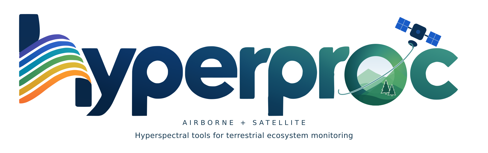

<div class="eyebrow">Imaging spectroscopy · Python · {{ source_version }}</div>

# One interface. Many spectral worlds.

{ .brand-banner .theme-light }
{ .brand-banner .theme-dark }

**Find, read, inspect, correct, and prepare airborne and satellite hyperspectral data through a shared Python interface.** hyperproc brings sensor-specific products into `xarray`, with processing tools for terrestrial ecosystem research and other imaging-spectroscopy applications.

**Installation · Python {{ python_requires }}**

```bash
pip install hyperproc                 # readers, correction, export
pip install 'hyperproc[search]'       # + archive search and download
pip install 'hyperproc[search-map]'   # + interactive notebook maps (ipyleaflet)
pip install 'hyperproc[brdf]'         # + Earth Engine for satellite BRDF
pip install 'hyperproc[atmos]'        # + ISOFIT atmospheric correction
hyperproc-atmos-setup --base /path/to/isofit_assets  # once: engines + data assets (~6 GB)
hyperproc-atmos-setup --engine LibRadTran           # optional: build libRadtran
hyperproc-atmos-setup --check                      # inspect installed assets
```

[Installation guide: environments, optional features, and setup requirements](getting-started/installation.md)

```python
import hyperproc as hp

ds = hp.open("/path/to/a/supported/provider_product")
hp.describe(ds)
ndvi = hp.spectral_index(ds, "NDVI")  # use suitable reflectance, not radiance
```

<div class="grid cards" markdown>

- **Start with one scene**

    Open a supported provider product, inspect its physical meaning, and make a small first output.

    [Read the quickstart](getting-started/quickstart.md)

- **Find data by place and date**

    Search NASA, NEON, and DLR, select granules in a notebook map, and download provider files.

    [Search and download](workflows/search.md)

- **Find your sensor**

    Product levels, required files, geometry, QA, and reader-specific caveats for airborne and satellite instruments.

    [Explore the sensor guides](sensors/index.md)

- **Follow a worked example**

    {{ notebooks }} original notebooks with {{ saved_figures }} saved figures, plus a curated AVIRIS-3 walkthrough.

    [Browse tutorials](tutorials/index.md)

- **Choose a scientific workflow**

    Atmospheric retrieval, terrain diagnostics, angular normalization, spectral processing, and aligned exports.

    [Use the decision guide](background/decision-guide.md)

- **Look up an API**

    Signatures, defaults, docstrings, and source across {{ api_modules }} Python modules. Private helpers are explicitly distinguished.

    [Open the API reference](api/index.md)

</div>

## Choose the right processing path

| Your input | Next step | Important distinction |
|---|---|---|
| Provider surface reflectance | Inspect QA; choose optional corrections or spectral analysis | Do not repeat atmospheric correction automatically |
| Supported L1 radiance | Optional ISOFIT retrieval | Input units, geometry, and external assets matter |
| Airborne reflectance group | Per-line topographic diagnostics and grouped FlexBRDF | Let diagnostic gates decide whether correction is justified |
| Satellite reflectance | Optional MCD43-based BRDF normalization | Broadband-derived angular shape is not a measured hyperspectral BRDF |

!!! note "Current package documentation"
    Built from the adjacent source and package metadata. hyperproc is MIT licensed; citation and maintainer details are available in the [project guide](project/governance.md). Saved notebook outputs are historical results. See [documentation status](project/status.md) for the snapshot and evidence limits.
