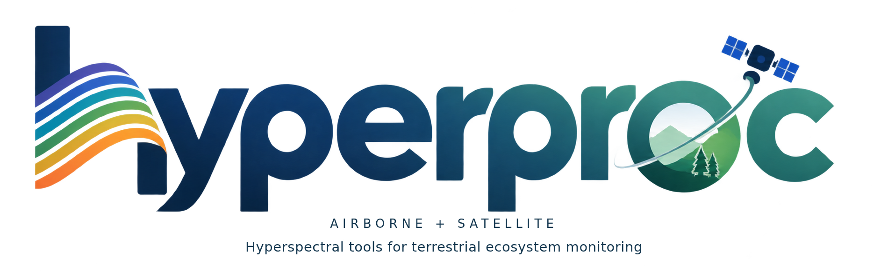
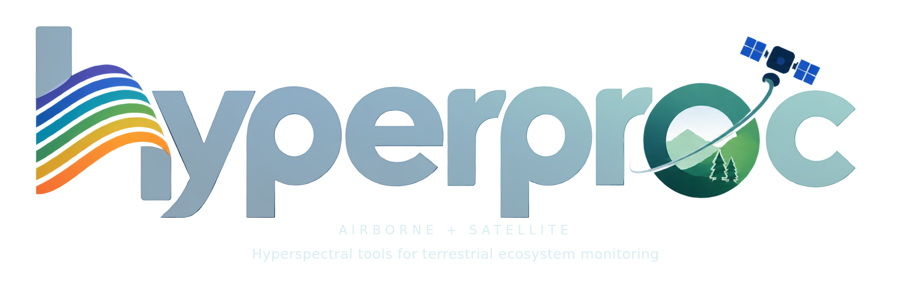

# About hyperproc

hyperproc is a Python package for reading and processing airborne and satellite imaging-spectroscopy data. This documentation presents the current local implementation and tutorials, with terrestrial ecosystem research as an application focus.

{ .brand-banner .theme-light }
{ .brand-banner .theme-dark }

## Visual identity

The identity combines six rising spectral ribbons in the “h”, a blue-to-green wordmark, a landscape with two trees inside the “o”, and an observation satellite. Website images preserve the supplied reference artwork and its lettering. Light- and dark-surface display images and editable SVG reconstructions are available below.

## People and contact

**Author and maintainer:** Fujiang Ji (`fujiang.ji@wisc.edu`), as declared in `pyproject.toml`. The citation metadata lists the University of Wisconsin–Madison affiliation. Visit the [repository](https://github.com/FujiangJi/hyperproc) or [issue tracker](https://github.com/FujiangJi/hyperproc/issues) for source and support. See [citation and license](governance.md) for the MIT license and software citation.

## Downloads

- [Rectangular display image — light](../assets/logos/rectangular.png)
- [Rectangular display image — dark](../assets/logos/rectangular-dark.png)
- [Circular display image — light](../assets/logos/circular.png)
- [Circular display image — dark](../assets/logos/circular-dark.png)
- [Editable rectangular SVG — light](../assets/logos/rectangular.svg)
- [Editable rectangular SVG — dark](../assets/logos/rectangular-dark.svg)
- [Editable circular SVG — light](../assets/logos/circular.svg)
- [Editable circular SVG — dark](../assets/logos/circular-dark.svg)

The supplied source is a PNG. Display PNGs retain its artwork; editable SVGs trace the letter and ribbon outlines and reconstruct the illustration as separate vector elements. They are not original font files or exact vector source files. Rectangular taglines remain editable text. The six-ribbon “h” is used as the favicon.
